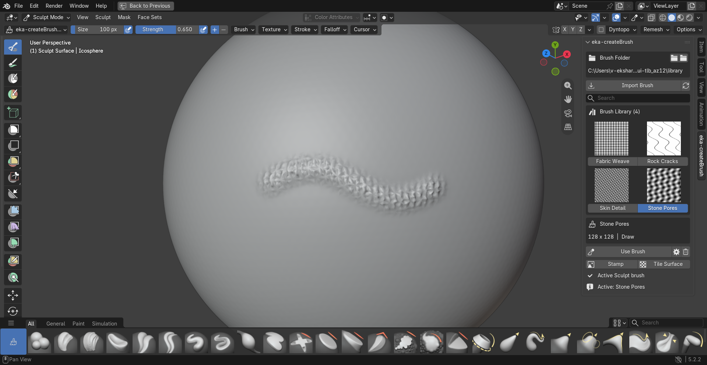

# eka-createBrush

eka-createBrush is a Blender 4.2+ extension for creating reusable Sculpt Mode brushes from grayscale images of any aspect ratio. It keeps a cached, searchable thumbnail library, copies source images into persistent user storage, and activates a selected brush with one click.

## Interface Preview



*A real Stone Pores stroke on the mesh, with four folder-synced brushes visible in the eka-createBrush gallery.*

## Features

- Imports PNG, JPEG, TIFF, and BMP images
- Accepts square, wide, and tall images and automatically fits them without stretching
- Rejects visibly colored input
- Warns when an image has too little tonal contrast to make a useful brush
- Uses one user-selected folder as the source of truth for the brush library
- Automatically adds, updates, renames, or removes brushes when that folder changes
- Stores imported images with readable filenames outside the extension install folder
- Shows every imported brush in a searchable two-column thumbnail gallery
- Reuses cached previews and keeps folder scanning out of panel redraws
- Activates a selected brush immediately when already in Sculpt Mode
- Enters Sculpt Mode automatically with **Use Brush**
- Offers **Stamp** for one faithful image impression and **Tile Surface** for continuous texture
- Supports Draw, Clay, Clay Strips, Inflate, Crease, Scrape, Fill, and Smooth behavior
- Supports Area Plane, View Plane, Stencil, Tiled, and Random image mapping
- Includes strength, size, spacing, falloff, height bias, inversion, pressure, front-face, and accumulation controls
- Renames, edits, refreshes, and permanently deletes saved brushes
- Reuses tagged Blender image, texture, and brush data instead of creating duplicates

## Install

1. Use `dist/eka-createBrush-1.3.0.zip`.
2. In Blender, open **Edit > Preferences > Add-ons**.
3. Open the menu and choose **Install from Disk**.
4. Select the ZIP and enable **eka-createBrush** if needed.

## Create A Brush

1. Prepare a grayscale image at any width-to-height ratio. White produces the strongest texture influence; black produces the least. Mid-gray provides intermediate height.
2. Open the 3D Viewport sidebar with `N`, then select the **eka-createBrush** tab.
3. Use the folder button under **Brush Folder** to choose the directory that should hold the library.
4. Click **Import Brush** and select the image.
5. Name the brush and choose its Sculpt, stamp, and pressure settings.
6. Keep **Use After Import** enabled to activate it immediately when a mesh is selected.

Every valid image in the selected folder appears directly in the gallery. Selecting a thumbnail while in Sculpt Mode activates that brush immediately. Outside Sculpt Mode, select a thumbnail and click **Use Brush**.

- Use **Stamp** to place the source image once. Drag to position the stamp, then release to apply it.
- Use **Tile Surface** to paint one fixed, repeating texture over a larger area without each brush dab restarting the image.
- Use **Use Brush** to keep the brush's saved mapping and stroke settings.

Sculpting moves existing mesh vertices. If the panel reports low mesh detail, enable Dyntopo, voxel-remesh at a fine size, or use a Multiresolution modifier before applying a detailed image.

## Image Guidelines

- Square, landscape, and portrait images are supported. The add-on preserves their proportions automatically.
- Use grayscale RGB or grayscale image data. Slight JPEG compression differences are tolerated.
- Use high contrast for a clear stamp. Flat or near-flat images have little sculpting effect.
- Keep important detail away from the image edge when using a radial falloff.
- Use a seamless source image with **Tile Surface** to avoid visible tile edges.
- Use PNG or TIFF when preserving fine height detail matters.
- An image dimension larger than 8192 pixels is rejected to prevent accidental memory spikes.

## Watched Brush Folder

The folder shown in the panel is the source of truth. Importing through the add-on copies the image into this folder with a readable filename. You can also place supported grayscale images of any aspect ratio directly in the folder; the gallery checks for changes automatically.

- Delete a brush in the add-on to remove its image, settings, and owned Blender runtime data.
- Delete an image in Explorer or Finder to remove that brush from the gallery.
- Rename an image in the folder to rename the gallery entry while preserving its settings when the file content is unchanged.
- Edit or replace an image to refresh its preview and runtime brush.

Brush-specific settings remain in the folder's `brushes.json` sidecar. Invalid colored, unreadable, or oversized images remain untouched on disk and are reported as skipped in the panel. Removing or updating the extension does not delete the selected folder.

## Compatibility

The release is tested with:

- Blender 4.2.23 LTS
- Blender 5.2.2 LTS

Blender 4.2 uses direct Sculpt brush assignment. Blender 5.x uses Blender's brush-asset activation API because its active Sculpt brush is read-only from Python.

## Tests

Run the storage test with Python:

```powershell
python tests\library_test.py
```

Run the Blender smoke test with a Blender executable:

```powershell
blender --background --factory-startup --python tests\blender_smoke_test.py
```

Run the real mouse-driven sculpt effect test in a visible Blender process:

```powershell
blender --factory-startup --enable-event-simulate --python tests\sculpt_effect_test.py
```